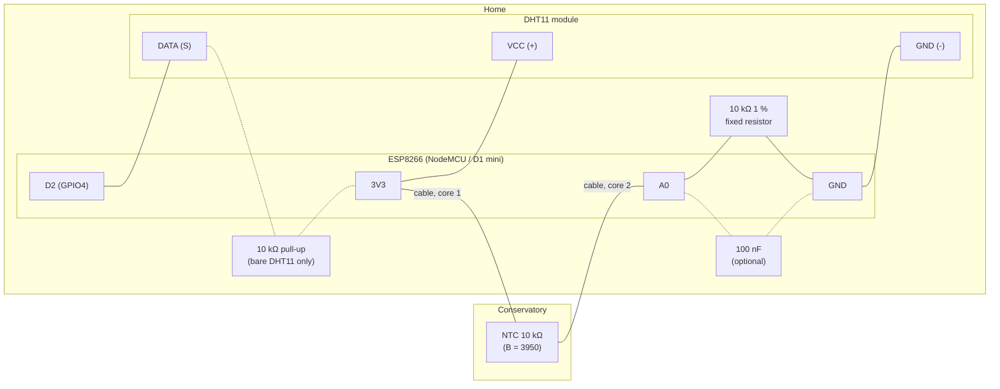

# ESP8266 sensor node: DHT11 + NTC 10kΩ

This page shows how to run **two temperature sensors from one ESP8266** and push both readings
to the app's ingestion endpoint (`POST /api/v1/readings`, see the
[README](../README.md#connecting-a-sensor)). One sensor sits next to the board, the other is on a
cable in the neighbouring room.

## Recommended placement

| Sensor | Location | Why |
| --- | --- | --- |
| **DHT11** (temp + humidity), on the board | **Home** | The DHT11 only works between **0 and 50 °C** and 20–80 % RH. An unheated conservatory drops below 0 °C on winter nights and goes above 50 °C in summer sun, so the DHT11 would fail there. Home stays well inside its range. The DHT11 is also unreliable on long wires, so it belongs right next to the ESP. |
| **NTC 10kΩ** (temp only), on a cable | **Conservatory** | An NTC works from about −40 to +125 °C and has much finer resolution than the DHT11 (0.1 °C instead of 1 °C). It is just a resistor, so a few metres of cable don't affect it. It's small, so it's easy to keep out of direct sun. |

The ESP and its USB power supply stay in the house, where WiFi and power are easy to reach. Only a
thin 2-core cable runs to the conservatory.

### Conservatory or home humidity?

**If the sensor could handle it, conservatory humidity would be the more useful one.** A heat
transfer moves conservatory air into the house. If the conservatory is humid (plants,
condensation on cold glass in the morning), you also bring that moisture inside. Conservatory
humidity would let the app warn you about that and could later become a model feature.

**With a DHT11, measure humidity in the home.** It can't survive the conservatory's temperature
range (see above). Home humidity is still worth having: it shows whether heat transfers push
indoor humidity up (mould risk) and it's a useful comfort metric. If you want conservatory
humidity later, use a sensor built for it, e.g. an **SHT31** or **BME280** (−40…+85 °C, 0–100 % RH,
I²C). Either one works in the setup below in place of the NTC.

> The sketch sends `humidity_pct` along with the Home reading. The server stores it with the
> reading and plots it on the dashboard chart's right-hand (% RH) axis.

## Parts

- ESP8266 dev board: **NodeMCU v2/v3 or Wemos D1 mini**. These boards have a built-in divider on
  `A0` that allows 0–3.2 V. A bare ESP-12 module only allows 0–1.0 V on its ADC, and the circuit
  below would need a different divider.
- DHT11: the 3-pin module on a small PCB is easiest because it already has its pull-up resistor.
- NTC 10kΩ thermistor (B = 3950 is the most common; check your datasheet, 3435 is also common)
- **1 × 10 kΩ resistor, 1 % tolerance**: fixed half of the NTC voltage divider
- 1 × 10 kΩ resistor: DHT11 pull-up, **only if you have a bare 4-pin DHT11** without a PCB
- 1 × 100 nF ceramic capacitor (optional but recommended): smooths noise picked up on the NTC cable
- 2-core cable to the conservatory (a twisted pair from an old network or alarm cable is ideal; up to ~10 m is fine)

## Wiring



The same circuit as a plain-text diagram:

```
 DHT11 module                 NodeMCU / D1 mini
 ┌────────┐
 │ VCC  + ├──────────────────── 3V3 ──────────┐
 │ DATA S ├──────────────────── D2 (GPIO4)    │
 │ GND  - ├──────────────────── GND ──┐       │
 └────────┘                           │       │
                                      │       │   2-core cable to the conservatory
                                      │       └─────────────────────────┐
                                      │                               [NTC 10k]
                                      │       ┌─────────────────────────┘
                                      │       │
                                      │      A0
                                      │       │
                                      │       ├──[10k 1%]──┐
                                      │       └──[100nF]───┤
                                      └────────────────────┘ GND
```

| From | To |
| --- | --- |
| DHT11 `VCC` (`+`) | `3V3` |
| DHT11 `GND` (`-`) | `GND` |
| DHT11 `DATA` (`S` / `OUT`) | `D2` (GPIO4) |
| *(bare DHT11 only)* 10 kΩ | between DHT11 `DATA` and `3V3` |
| NTC leg 1 (via cable) | `3V3` |
| NTC leg 2 (via cable) | `A0` |
| 10 kΩ 1 % fixed resistor | between `A0` and `GND` |
| 100 nF capacitor | between `A0` and `GND` (next to the board) |

Notes:

- **`D2` (GPIO4)** is used because it has no boot-mode function. Avoid `D3`, `D4` and `D8`. The
  ESP8266 checks those pins at startup, and a sensor attached to them can stop the board from booting.
- **The NTC sits on the 3V3 side and the fixed resistor on the GND side.** The board's internal
  `A0` divider (220 kΩ + 100 kΩ ≈ 320 kΩ to GND) is in parallel with the lower resistor. With the
  fixed resistor at the bottom, that parallel value is known, and the sketch corrects for it.
  Without the correction, readings would be about 0.7 °C off.
- The ESP8266 has **only one analog input**. That's why this setup combines one digital sensor
  (DHT11) with one analog sensor (NTC). A second NTC would need an external ADC such as an ADS1115.
- At the conservatory end, hang the NTC **in the shade, in free air**, not on the glass, a wall or
  a sunlit surface. Direct sun on the sensor easily adds 10 °C or more. A white plastic cap or a
  small shade made from a white yogurt pot with holes works well.
- The divider draws about 0.17 mA continuously. That heats the NTC by roughly 0.2 °C, which is
  small next to the 3 °C transfer threshold.

## Registering the sensors in the app

Every API key belongs to exactly one location. That means **one ESP with two sensors needs two
API keys**:

1. **Settings → Sensors → add**: name `esp-home-dht11`, location **Home**. Copy the key.
2. **Settings → Sensors → add**: name `esp-conservatory-ntc`, location **Conservatory**. Copy the key.
3. Paste both keys into the configuration block at the top of the sketch.

The sketch also sends `"location"` with each reading. If the two keys get swapped by mistake, the
server rejects the reading with `400` instead of recording it under the wrong room.

## Arduino IDE setup

1. **File → Preferences → Additional boards manager URLs**:
   `https://arduino.esp8266.com/stable/package_esp8266com_index.json`
2. **Tools → Board → Boards Manager** → install **esp8266** by ESP8266 Community.
3. **Sketch → Include Library → Manage Libraries** → install **DHT sensor library** by Adafruit
   (accept the prompt to also install **Adafruit Unified Sensor**).
4. **Tools → Board**: `NodeMCU 1.0 (ESP-12E Module)` or `LOLIN(WEMOS) D1 R2 & mini`.
5. Fill in the configuration block, upload, and open the Serial Monitor at **115200 baud**.

## Sketch

Save as `solar_heat_sensor/solar_heat_sensor.ino`.

```cpp
/*
 * Solar-Heat-Predictions sensor node
 *
 * One ESP8266 (NodeMCU / Wemos D1 mini), two sensors:
 *   - DHT11 on D2           -> "home"          (temperature + humidity)
 *   - NTC 10k divider on A0 -> "conservatory"  (temperature)
 *
 * Every READ_INTERVAL_MS both sensors are read and each value is POSTed to
 *   POST <SERVER_URL>/api/v1/readings   with its own X-API-Key.
 *
 * Libraries: "esp8266" board package, "DHT sensor library" (Adafruit)
 *            + "Adafruit Unified Sensor".
 */

#include <ESP8266WiFi.h>
#include <ESP8266HTTPClient.h>
#include <WiFiClient.h>
#include <DHT.h>
#include <math.h>

// ---------------------------------------------------------------------------
// Configuration: edit these
// ---------------------------------------------------------------------------
const char* WIFI_SSID     = "your-wifi";
const char* WIFI_PASSWORD = "your-password";

// Base URL of the app on your LAN, no trailing slash.
const char* SERVER_URL = "http://192.168.1.50:5000";

// Keys from Settings -> Sensors (one per location).
const char* HOME_API_KEY         = "paste-home-sensor-key";
const char* CONSERVATORY_API_KEY = "paste-conservatory-sensor-key";

const unsigned long READ_INTERVAL_MS = 5UL * 60UL * 1000UL;  // 5 minutes

// DHT11
const uint8_t DHT_PIN  = D2;   // GPIO4
const uint8_t DHT_TYPE = DHT11;

// NTC thermistor (check your datasheet)
const float NTC_R25   = 10000.0;  // resistance at 25 °C, ohms
const float NTC_BETA  = 3950.0;   // B-value (3950 or 3435 are common)
const float R_FIXED   = 10000.0;  // fixed divider resistor between A0 and GND, ohms

// Board ADC characteristics (NodeMCU / Wemos D1 mini)
const float SUPPLY_V       = 3.3;       // voltage on the 3V3 pin; measure it for best accuracy
const float ADC_FULL_SCALE = 3.2;       // A0 voltage that reads as 1023
const float R_A0_LOAD      = 320000.0;  // on-board 220k + 100k divider seen from A0 to GND
const int   ADC_SAMPLES    = 32;

// Optional calibration offsets, found by comparing against a reference thermometer.
const float HOME_OFFSET_C         = 0.0;
const float CONSERVATORY_OFFSET_C = 0.0;
// ---------------------------------------------------------------------------

DHT dht(DHT_PIN, DHT_TYPE);
WiFiClient wifiClient;
unsigned long lastReadAt = 0;
bool firstRun = true;

void connectWiFi() {
  if (WiFi.status() == WL_CONNECTED) return;

  Serial.printf("Connecting to %s", WIFI_SSID);
  WiFi.mode(WIFI_STA);
  WiFi.begin(WIFI_SSID, WIFI_PASSWORD);

  unsigned long start = millis();
  while (WiFi.status() != WL_CONNECTED && millis() - start < 20000) {
    delay(500);
    Serial.print('.');
  }
  Serial.println();

  if (WiFi.status() == WL_CONNECTED) {
    Serial.printf("WiFi connected, IP %s\n", WiFi.localIP().toString().c_str());
  } else {
    Serial.println("WiFi connection failed, will retry next cycle");
  }
}

// Returns NAN if the reading is implausible (open or shorted NTC cable).
float readNtcCelsius() {
  long sum = 0;
  for (int i = 0; i < ADC_SAMPLES; i++) {
    sum += analogRead(A0);
    delay(2);
  }
  float raw = (float)sum / ADC_SAMPLES;

  if (raw < 5 || raw > 1018) {
    Serial.printf("NTC: ADC raw %.1f out of range, check wiring\n", raw);
    return NAN;
  }

  float vOut = raw / 1023.0 * ADC_FULL_SCALE;

  // Lower leg of the divider = fixed resistor in parallel with the board's A0 divider.
  float rBottom = (R_FIXED * R_A0_LOAD) / (R_FIXED + R_A0_LOAD);
  float rNtc = rBottom * (SUPPLY_V / vOut - 1.0);

  // Beta equation: 1/T = 1/T0 + ln(R/R0)/B
  float invT = 1.0 / 298.15 + log(rNtc / NTC_R25) / NTC_BETA;
  float celsius = 1.0 / invT - 273.15;

  Serial.printf("NTC: raw %.1f, %.3f V, %.0f ohm, %.2f C\n", raw, vOut, rNtc, celsius);
  return celsius + CONSERVATORY_OFFSET_C;
}

bool postReading(const char* apiKey, const char* location, float valueC, float humidityPct) {
  if (WiFi.status() != WL_CONNECTED) return false;

  HTTPClient http;
  String url = String(SERVER_URL) + "/api/v1/readings";
  if (!http.begin(wifiClient, url)) {
    Serial.println("HTTP: begin() failed");
    return false;
  }
  http.setTimeout(10000);
  http.addHeader("Content-Type", "application/json");
  http.addHeader("X-API-Key", apiKey);

  String body = String("{\"location\":\"") + location + "\",\"value_c\":" + String(valueC, 2);
  if (!isnan(humidityPct)) {
    body += ",\"humidity_pct\":" + String(humidityPct, 1);
  }
  body += "}";

  int status = http.POST(body);
  String response = http.getString();
  http.end();

  Serial.printf("POST %s -> %d %s\n", location, status, response.c_str());
  return status == 201;
}

void readAndSend() {
  connectWiFi();

  // --- Home: DHT11 ---
  float homeC = dht.readTemperature();
  float homeRh = dht.readHumidity();
  if (isnan(homeC) || isnan(homeRh)) {
    delay(2000);  // DHT11 needs >= 1 s between reads; retry once
    homeC = dht.readTemperature();
    homeRh = dht.readHumidity();
  }
  if (isnan(homeC)) {
    Serial.println("DHT11: read failed, check wiring");
  } else {
    homeC += HOME_OFFSET_C;
    Serial.printf("DHT11: %.1f C, %.0f %%RH\n", homeC, homeRh);
    postReading(HOME_API_KEY, "home", homeC, homeRh);
  }

  // --- Conservatory: NTC ---
  float conservatoryC = readNtcCelsius();
  if (!isnan(conservatoryC)) {
    postReading(CONSERVATORY_API_KEY, "conservatory", conservatoryC, NAN);
  }
}

void setup() {
  Serial.begin(115200);
  delay(100);
  Serial.println("\nSolar-Heat-Predictions sensor node");

  dht.begin();
  connectWiFi();
}

void loop() {
  unsigned long now = millis();
  if (firstRun || now - lastReadAt >= READ_INTERVAL_MS) {
    firstRun = false;
    lastReadAt = now;
    readAndSend();
  }
  delay(100);
}
```

## Checking it works

- **Serial Monitor**: every cycle should show the raw NTC values and two
  `POST ... -> 201` lines.
- **`401`**: wrong or revoked API key. **`400 ... registered for 'x'`**: the two keys are swapped.
  **`-1` / connection refused**: `SERVER_URL` is wrong, or the app isn't reachable from the ESP
  (check the port, and that the ESP and server are on the same network).
- **Settings → Sensors** shows *last seen* for each key, which is a quick way to confirm both
  sensors are arriving.
- **Sanity check**: put the NTC right next to the DHT11 for 15 minutes before moving it to the
  conservatory. They should agree within about 1–2 °C, since the DHT11 is only ±2 °C accurate. If
  the NTC is consistently off against a good reference thermometer, first set `SUPPLY_V` to the
  voltage you measure on the `3V3` pin. Use `CONSERVATORY_OFFSET_C` for whatever difference is left.
