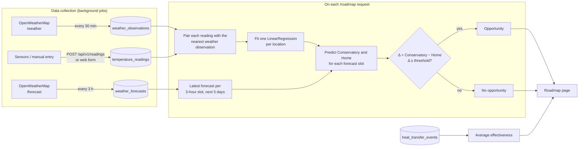
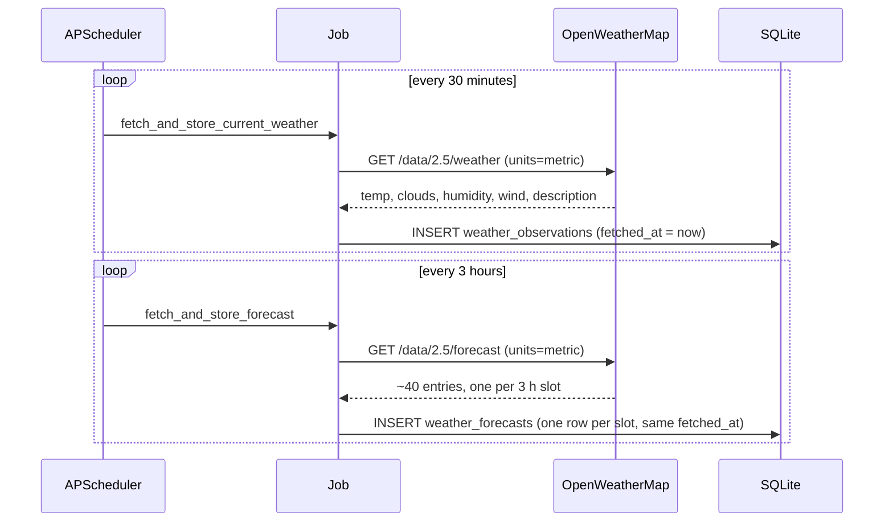
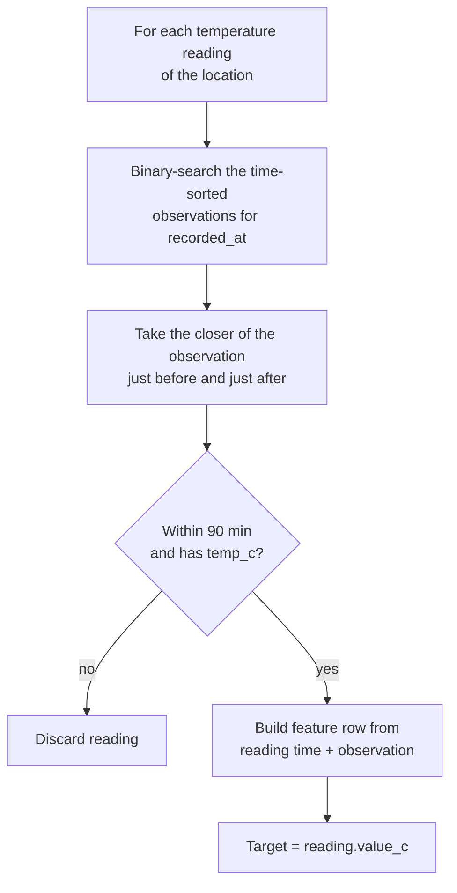
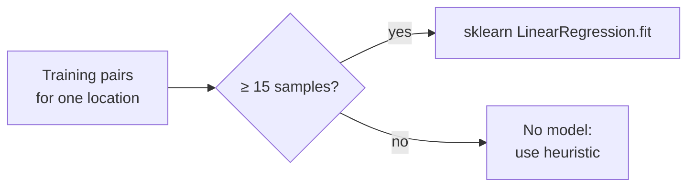
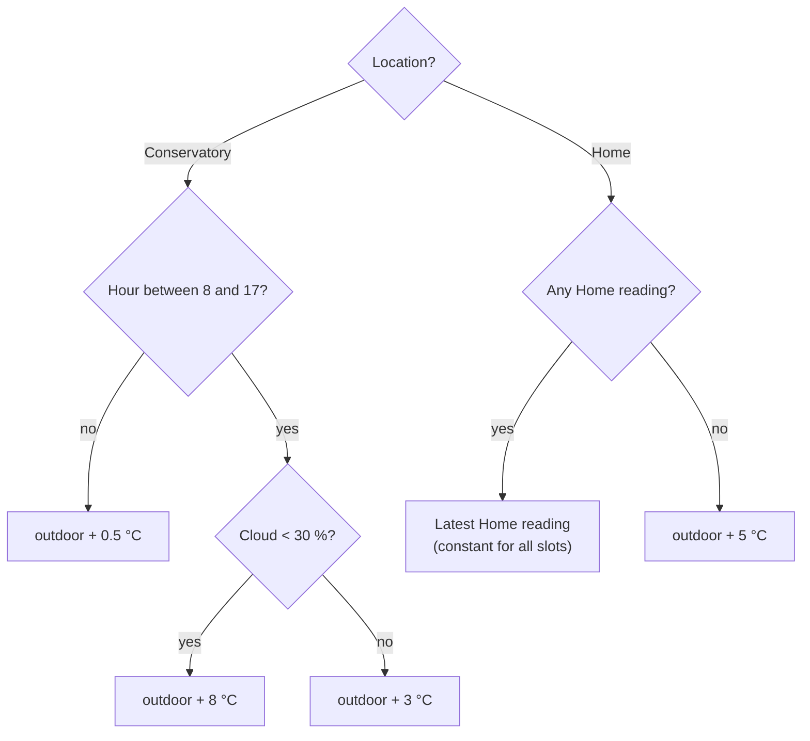
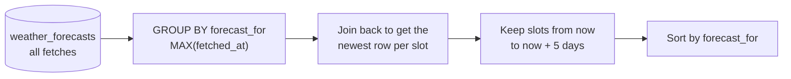
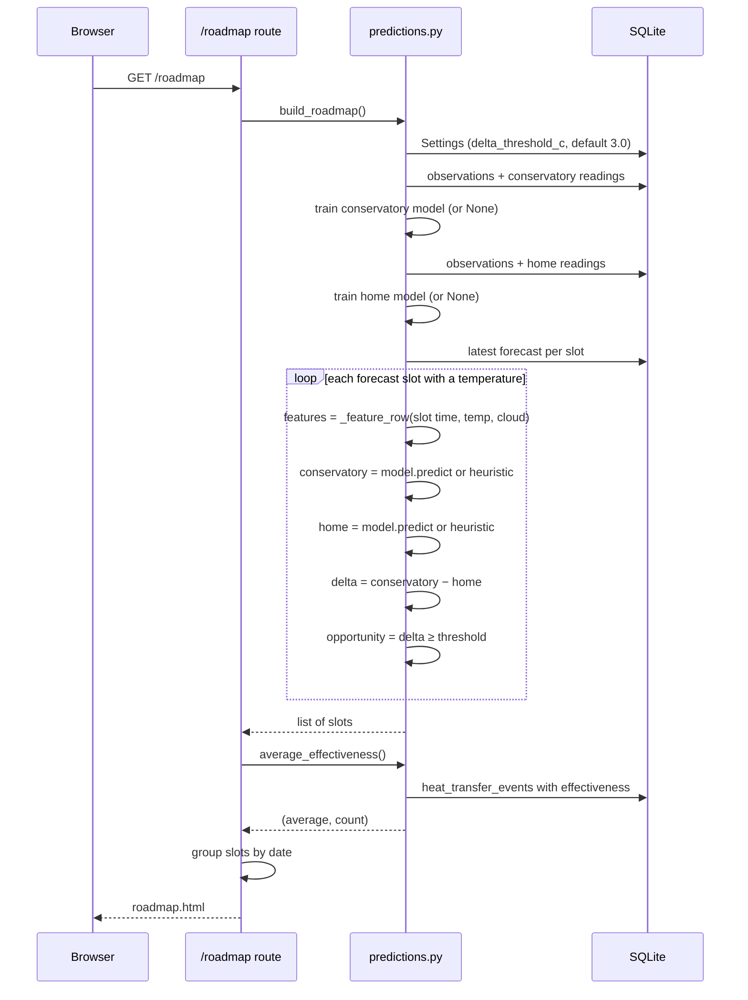
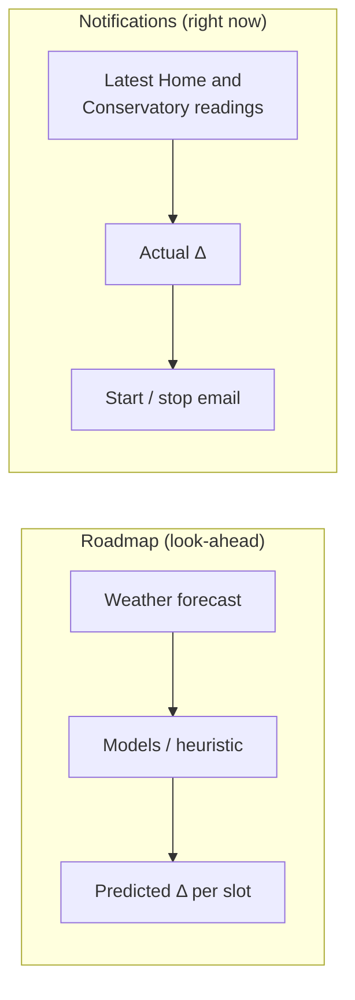

# How the forecast and predictions work

This page explains how the app gets from raw weather data and temperature readings to the
**Solar heat roadmap** (`/roadmap`): a table for the next 5 days showing, every 3 hours, the
predicted Conservatory and Home temperatures and whether a heat transfer is worth doing.

The code lives in:

| File | Responsibility |
| --- | --- |
| [app/scheduler.py](../app/scheduler.py) | Background jobs that fetch weather data and store it |
| [app/services/weather.py](../app/services/weather.py) | Thin OpenWeatherMap API client |
| [app/services/predictions.py](../app/services/predictions.py) | Model training, heuristic fallback, roadmap construction |
| [app/web/roadmap.py](../app/web/roadmap.py) | `/roadmap` route, groups slots by day |
| [app/templates/web/roadmap.html](../app/templates/web/roadmap.html) | Renders the roadmap tables |

## Overview



There are two separate kinds of weather data, and they play different roles:

- **Observations** (current weather, stored every 30 minutes) are what *actually happened*.
  They are paired with the temperatures you logged to **train** the models.
- **Forecasts** (5-day / 3-hour forecast, stored every 3 hours) are what *is expected to happen*.
  They are the **input** fed into the trained models to produce the roadmap.

## 1. Weather ingestion

Both jobs are registered in `init_scheduler` and run in-process via APScheduler. Each job
does nothing until the setup wizard is complete (it needs latitude, longitude and an API key
from `Settings`).



If the API can't be reached or returns an error, the job logs a warning and skips that run;
the next run tries again.

Forecast rows are **never updated in place**. Every fetch appends a fresh set of rows, so the
same `forecast_for` time slot ends up with several rows from different fetches. The roadmap
only uses the most recent one (see [step 3](#3-selecting-forecast-slots)).

All timestamps are stored as naive UTC.

## 2. Training the models

A model is trained separately for **Conservatory** and **Home**. Garden readings are collected
but not used for predictions.

Models are trained fresh on every roadmap request instead of being stored. With a household's
worth of data (dozens to a few hundred rows), fitting takes a few milliseconds, and it means the
model always reflects your latest readings.

### Building the training set

Temperature readings and weather observations are recorded at different times, so each reading
first has to be matched to the weather at that moment:



### Features

Every sample, both for training and for prediction, is turned into the same six features
(`_feature_row`):

| # | Feature | Why |
| --- | --- | --- |
| 1 | Outdoor temperature (°C) | Baseline the rooms drift towards |
| 2 | Cloud cover (%), or 50 if unknown | Proxy for sunshine, which drives Conservatory heating |
| 3–4 | `sin` / `cos` of the hour of day | Time of day as a circle, so 23:00 and 01:00 end up close together |
| 5–6 | `sin` / `cos` of the day of year | Season, which affects sun angle and day length |

The hour and day are encoded as sine/cosine pairs because a linear model can't handle
wrap-around on its own: as a plain number, hour 23 and hour 0 would look as far apart as they
possibly could be.

### Fitting



The model is ordinary least-squares linear regression:

```
predicted_temp = b0 + b1·outdoor + b2·cloud + b3·sin(hour) + b4·cos(hour) + b5·sin(day) + b6·cos(day)
```

The threshold is `MIN_TRAINING_SAMPLES = 15` matched pairs per location.

### Heuristic fallback

Until a location has 15 matched samples, `_heuristic_predict` gives a rough estimate:



The Home heuristic ignores the weather on purpose: indoor temperature mostly depends on the
heating and insulation, so the last known value is a better guess than anything based on the
outdoor temperature.

> **Note:** the hour check in the heuristic (and the hour features) use **UTC** hours, not
> local time. In Central Europe, "8–17 UTC" is 9–18 local time in winter and 10–19 in summer.

## 3. Selecting forecast slots

`_latest_forecasts` removes the duplicates created by repeated forecast fetches:



Result: one row per 3-hour slot (about 40 slots), each holding the most recent forecast for that
time.

## 4. Building the roadmap

`build_roadmap` puts it all together:



Each slot contains:

| Field | Meaning |
| --- | --- |
| `forecast_for` | Start of the 3-hour forecast slot (UTC) |
| `outdoor_temp`, `cloud_pct`, `condition` | Taken directly from the forecast |
| `predicted_conservatory`, `predicted_home` | Model or heuristic output, rounded to 0.1 °C |
| `predicted_delta` | Conservatory − Home |
| `opportunity` | `true` if `delta ≥ delta_threshold_c` (from Settings) |
| `using_model` | `true` only if **both** locations have a trained model |

Because `using_model` requires both models, the page shows the "rough heuristic estimates"
hint even if just one of the two locations still has too little data. In that case the other
location is still predicted by its trained model.

### Effectiveness

When a heat transfer is stopped (or edited), its effectiveness is stored as
`home_temp_end − home_temp_start`. The roadmap shows the average of all recorded values
("acting on an opportunity has typically raised Home by about +X °C"). This number is
**only displayed**. It does not feed into the models.

## 5. Predictions vs. live notifications

The roadmap and the email alerts are independent. The notification job
(`evaluate_notifications`, every 5 minutes) uses only the **latest actual sensor readings**
and doesn't look at forecasts or models:



The roadmap is for planning ("Thursday afternoon looks good"), and the notification tells you
when to actually open the door.

## Improving prediction quality

- **Log more readings, at many times of day.** Only readings within 90 minutes of a weather
  observation count, so readings made before the app started fetching weather are unused.
- **Keep the weather job running.** Gaps in observations mean readings from those periods
  can't be matched.
- **Expect seasonal drift early on.** The day-of-year features only become meaningful once the
  data spans a good part of the year. Until then, the model extrapolates season effects
  from limited data.
- **Linear limits.** The model can't capture interactions such as "sun only matters during
  the day" (cloud × hour). If predictions stay poor with plenty of data, a model that handles
  interactions, such as gradient boosting, would be the natural next step.
